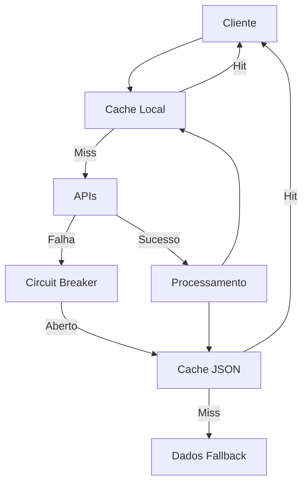

# Arquitetura Técnica do LIMFS

## Visão Geral

O LIMFS utiliza uma arquitetura em camadas com foco em resiliência e confiabilidade. O sistema é projetado para continuar funcionando mesmo em condições adversas, como falhas de API ou conexão instável.

## Camadas do Sistema

### 1. Interface do Usuário
- Componentes modulares em JavaScript puro
- Visualizações responsivas com CSS Grid e Flexbox
- Gráficos interativos usando Chart.js
- Suporte completo a acessibilidade (WCAG 2.1)

### 2. Gerenciamento de Dados

#### Cache Multinível
1. **Cache Local (localStorage)**
   - Dados recentes para acesso rápido
   - TTL configurável por tipo de dado
   - Invalidação automática

2. **Arquivos JSON**
   - Backup persistente de dados
   - Atualização periódica via APIs
   - Estrutura padronizada por indicador

3. **Dados de Fallback**
   - Conjunto mínimo de dados históricos
   - Garantia de funcionamento offline
   - Atualização manual verificada

### 3. Comunicação com APIs

#### Circuit Breaker
- Prevenção de sobrecarga
- Estados: CLOSED, OPEN, HALF-OPEN
- Configuração por endpoint:
  ```javascript
  {
    falhas_consecutivas_max: 5,
    periodo_pausa: 300000, // 5 minutos
    periodo_verificacao: 60000 // 1 minuto
  }
  ```

#### Retry com Backoff Exponencial
- Tentativas configuráveis por endpoint
- Delay aumenta exponencialmente
- Limite máximo de retry por período
- Exemplo de configuração:
  ```javascript
  {
    max_tentativas: 3,
    delay_inicial: 1000,
    max_delay: 30000
  }
  ```

### 4. Sistema de Monitoramento

#### Níveis de Log
- INFO: Operações normais
- WARN: Situações suspeitas
- ERROR: Falhas recuperáveis
- CRITICAL: Falhas sistêmicas

#### Métricas Coletadas
- Tempo de resposta das APIs
- Taxa de sucesso/falha
- Uso de cache/fallback
- Erros por tipo/endpoint

#### Persistência
- Logs críticos salvos localmente
- Rotação automática de logs
- Exportação para análise

### 5. Testes Automatizados

#### Cobertura
- Unitários: Funções core
- Integração: Fluxos completos
- E2E: Simulação de usuário

#### Validações
- Performance
- Acessibilidade
- Compatibilidade
- Segurança

## Fluxo de Dados



## Estratégias de Resiliência

### Circuit Breaker
1. **Estado Normal (Closed)**
   - Operação normal
   - Contagem de falhas

2. **Estado Aberto (Open)**
   - Após N falhas
   - Rejeição imediata
   - Timer de recuperação

3. **Meio-Aberto (Half-Open)**
   - Teste de recuperação
   - Limite de requests
   - Monitoramento intensivo

### Cache
1. **Política de Invalidação**
   - TTL por tipo de dado
   - Invalidação manual
   - Atualização em background

2. **Estratégia de Atualização**
   - Lazy loading
   - Prefetch de dados críticos
   - Refresh periódico

## Configurações de Produção

### Monitoramento
```javascript
{
    nivelMinimo: "INFO",
    maxLogsSalvos: 100,
    maxErrosSalvos: 50,
    intervaloEnvioRelatorios: 3600000
}
```

### Performance
```javascript
{
    cacheTimeout: 86400000,
    maxTentativasAPI: 3,
    timeoutRequisicao: 8000
}
```

## Decisões de Arquitetura

### Por que JavaScript Puro?
- Menor overhead
- Melhor performance
- Maior controle
- Sem dependências externas

### Por que Cache Multinível?
- Resiliência máxima
- Performance otimizada
- Experiência offline
- Economia de recursos

### Por que Monitoramento Detalhado?
- Diagnóstico rápido
- Melhoria contínua
- Prevenção de problemas
- Análise de padrões

## Limitações Conhecidas

1. **Cache Local**
   - Limite de armazenamento
   - Necessidade de limpeza

2. **APIs Externas**
   - Rate limiting
   - Indisponibilidade
   - Mudanças de formato

3. **Performance**
   - Carga inicial de dados
   - Processamento de gráficos
   - Memória em dispositivos limitados

## Evolução Futura

### Curto Prazo
- [ ] Implementar PWA
- [ ] Adicionar service workers
- [ ] Melhorar compressão

### Médio Prazo
- [ ] Microsserviços
- [ ] API Gateway
- [ ] Cache distribuído

### Longo Prazo
- [ ] Machine Learning
- [ ] Predição de dados
- [ ] Análise avançada